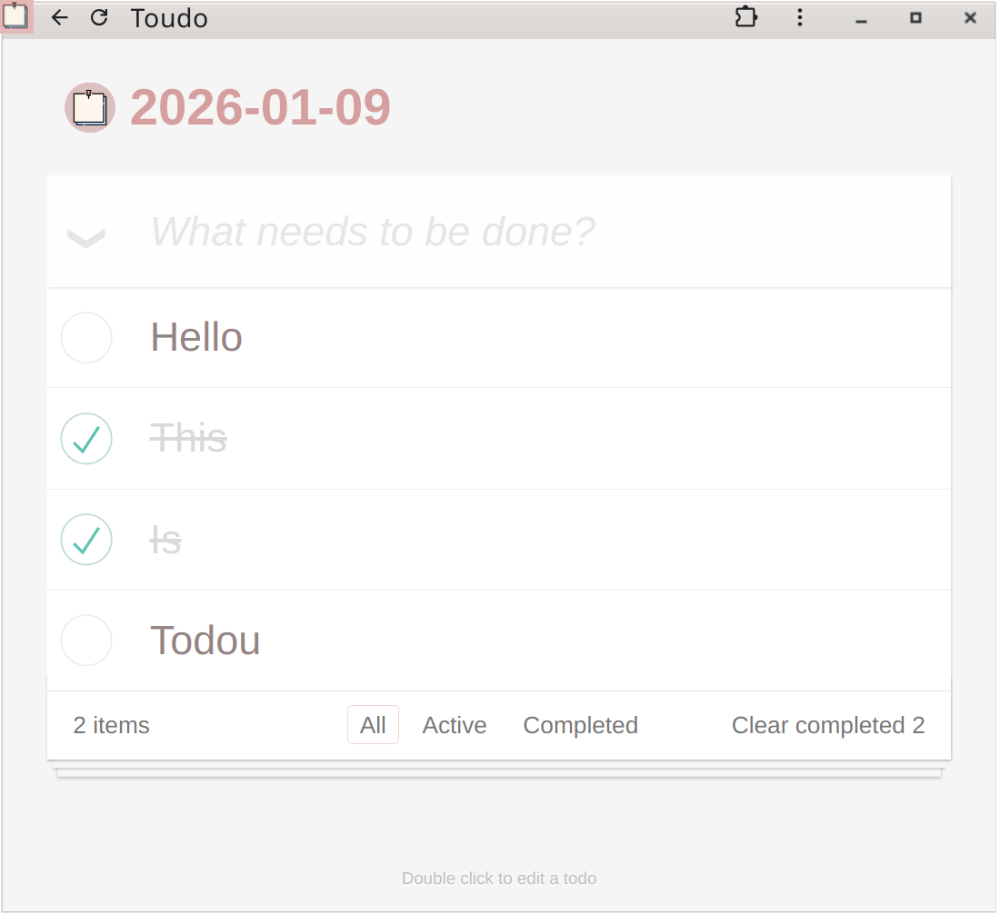
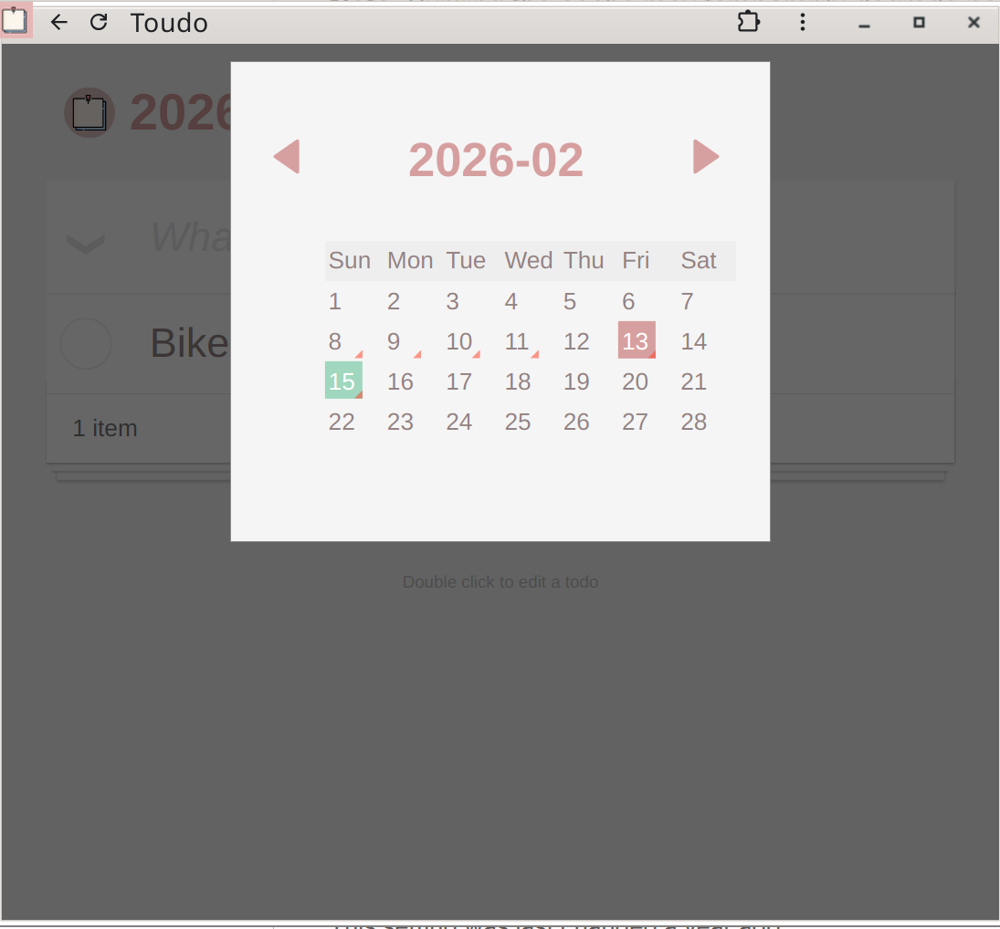

# Todou

Todou is a lightweight, flexible, and robust todo app. It is with minimal clutter and can interface with multiple persistent storage backends.




## Features

- **Mutiple backend storage**: Support Local Filesystem, SQlite, and Amazon S3.
- **Nix Ready**: Come with a nix module.
- **Minimal**: Just a todo. Nothing else.


## Storage Backends

Todou is flexible about where the data lives. You can choose your backend using the --storage flag:

|Backend|Flag Format|Description|
|-------|-----------|-----------|
|Filesystem|dir:/path/to/data|Saves each day as a .todou text file in a directory.|
|SQLite|sqlite:/path/to/db.sqlite|Uses a relational database for structured storage.|
|S3|s3:bucket-name|Stores data in an AWS S3 bucket (or S3-compatible API).|


## Docker

There is a multi-stage Docker image. To try it out, run the following commands:

```bash
docker build -t todou-app .
mkdir -p todo-data
docker run --name todou-app \
    -p 5000:5000 \
    -v $(pwd)/todo-data:/data \
    todou-app
```

The default parameter uses `--storage=dir:/data`, so this will run todou on port 5000.

Here is another example to run Todou with S3 backend.

```bash
docker run --name todou-app \
    -e AWS_ACCESS_KEY_ID=XYZ
    -e AWS_SECRET_ACCESS_KEY=123 \
    -p 8080:8080 \
    todou-app -port=8080 --storage="s3:my-bucket"
```

## Nix

Todou provides a nix module out of the box. It supports running multiple instances of the service. The following is the basic setup:

```nix
{ config, pkgs, ... }: {
  services.todou."personal" = {
    enable = true;
    port = 5000;
    storage = "dir:/var/lib/todou";
  };
}
```

For S3 storage, you can provide environment variables (like AWS keys) an internal file with tools like `nix-sops` to keep the secrets safe. The environment file should contain normal aws secrets like `AWS_ACCESS_KEY_ID`, `AWS_SECRET_ACCESS_KEY`, etc.

services.todou."work" = {
  enable = true;
  port = 5001;
  storage = "s3:my-company-todos";
  environment = "/run/secrets/todou-s3-creds";
};


## Cli

If you are running the binary directly:

```
# Using local directory
todou --port=8080 --storage="dir:./todos"

# Using SQLite
todou --port=8080 --storage="sqlite:db.sqlite"
```

## Design

Todou uses a buffered model, data is loaded from storage into an in-memory buffer on demand. Mutations happen instantly in memory. A background flusher thread runs every 5 seconds to persist "dirty" cahnges back to the storage backend.

This design avoids frequent access to the storage, but we have to make sure the writer is unique, otherwise the buffer can go out of sync. So be aware if you want to spin multiple instances hosting the same storage backend.


## Development

Backend is a simple Scotty app, the frontend uses a custom virtual dom, you can find it [here](/js/vdom.ts).
